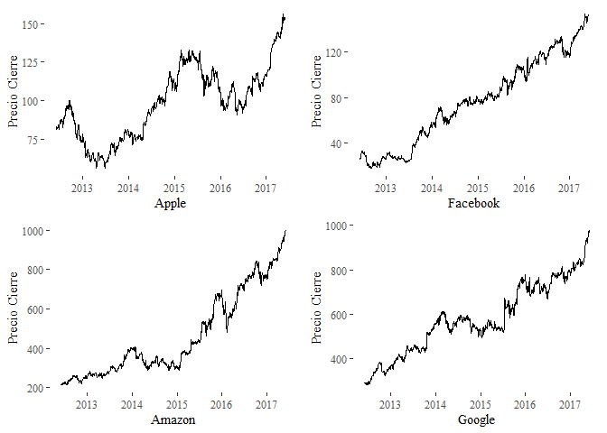
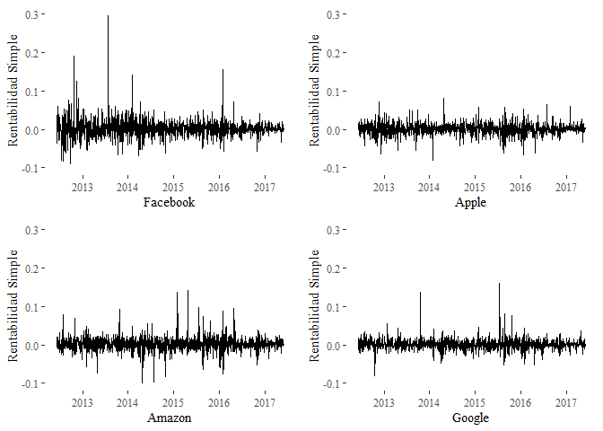

## Introducción.

En este documento, se analizará los rendimientos desde el 4 de junio del 2012, hasta el 1 de junio del 2017, de las acciones de Apple, Google (actualmente llamado Alphabet), Amazon y Facebook. Estás cotizaciones provienen dela bolsa NASDAQ.


### Paquetes Requeridos.

```r
library(csv)
library(forecast)
library(tseries)
library(timeDate)
library(timeSeries)
library(gridExtra)
library(ggplot2)
library(ggthemes)
library(plotly)
library(ps)
```

### importar y Tratar los datos.


```r
setwd("C:/Users/aleja/Documents/Universidad/Analisis de Riesgo 2020-2")
data1=read.csv(file = "acciones.csv", header = T,sep = ",")
head(data1)
tail(data1)
dim(data1) # 1257

#TRANSFORMAR EL FORMATO DE LAS FECHAS
data1$Date=as.Date(data1$Date,format = "%m/%d/%Y")
class(data1$Date)

#ORDENAR AÑO/MES/DÍA
data1$Date=format(data1$Date,"%Y-%m-%d")
head(data1)
class(data1$Date)

#CAMBIO EL FORMATO DE LA FECHA NUEVAMENTE
data1$Date=as.Date(data1$Date)
class(data1$Date)
```


## Análisis de Precios de Cierre.

Un precio de cierre es el último nivel en el que se negoció un activo antes de que el mercado cerrara en un día determinado. Los precios de cierre se utilizan a menudo como marcador cuando se observan los movimientos a largo plazo. Pueden compararse con los precios de cierre anteriores o con el precio de apertura para medir el movimiento de un activo en un solo día.[(Fuente).](https://www.ig.com/es/glosario-trading/definicion-de-precio-de-cierre#:~:text=Un%20precio%20de%20cierre%20es,los%20movimientos%20a%20largo%20plazo.)


```r
p1<-ggplot(data = data1, aes(x=Date, y=AAPL))+
        geom_line()+
        theme_tufte()+
        xlab("Apple") + ylab("Precio Cierre" )

p2<-ggplot(data = data1, aes(x=Date, y=FB))+
        geom_line()+
        theme_tufte()+
        xlab("Facebook") + ylab("Precio Cierre")

p3<-ggplot(data = data1, aes(x=Date, y=AMZN))+
        geom_line()+
        theme_tufte()+
        xlab("Amazon") + ylab("Precio Cierre")


p4<-ggplot(data = data1, aes(x=Date, y=GOOG))+
        geom_line()+
        theme_tufte()+
        xlab("Google") + ylab("Precio Cierre")
```


```r
grid.arrange(p1, p2, p3, p4, ncol=2, nrow=2)
```



```r
#subplot(p1, p2 , p3, p4,  nrows=2, margin = c(0.1, 0.01,0.01,0.01), 
#        titleX = T, titleY = T)
```


**Apple**: Al inicio de la serie (primer trimetre 2013) se observan incrementos en los precios de las acciones, pero posteriormete hubo un periodo de perdidas y estabilización entre el trimestre 4 de 2013 hasta trimestre 2 de 2014.
Los precios se recuperan entre el último trimestre del 2014 y crecen fuertemente hasta el trimestre 1 del 2016, lo sucede una estabilidad todo el año 2016, para el primer trimestre del 2017 volverse a disparar.

**Facebook**: tiene un compartiento de sus acciones muy positivo, ya que aunque durante en el inicio de la serie hay un periodo de crecimiento nulo, a partir del año 2014 se ve una tendencia al crecimiento muy pronunciada.

**Amazon**: hay un comportamiento de estabilidad desde el ultimo trimestre del año 2012 hasta el último trimestre del año 2013; hay un periodo de crecimento efímero en el primer trimestre del año 2014 para volver a descender, pero a partir del primer trimestre del 2015, se disparo al alza el precio de las acciones.

**Google**: existe un comportamiento al alza desde el inicio de la serie, para posteriormente tener un periodo de estabilidad desde el tercer trimestre del año 2014 hasta el último trimestre del año 2015. Desde el primer trimestre del año 2016, se ve una tendencia al alza clara.

## Análisis de los Rendimientos Simples.

Al analizar la rentabilidad de una inversión es importante expresarla como un porcentaje de ganancia o pérdida sobre esta aportación inicial. Esto es lo que se conoce como rentabilidad simple. Calcular este dato es relativamente sencillo. 

De forma resumida, la rentabilidad simple se podría expresa con la siguiente fórmula: **RS = (Valor final + Rendimientos – Gastos – Inversión inicial) / Inversión inicial**. [(Fuente).](https://www.ennaranja.com/inversores/conceptos-basicos/que-es-la-rentabilidad-anualizada-y-como-se-aplica-para-calcular-el-resultado-de-tu-inversion/#:~:text=De%20forma%20resumida%2C%20la%20rentabilidad,y%20con%20distintos%20horizontes%20temporales.&text=Invierte%20la%20cantidad%20que%20quieras.)

Las graficas de los rendimientos simples tienen todas la misma escala, para poder apreciar y comparar mas facilmente la diferencia entre ellas.


```r
data3=data.frame(DATE=data1$Date,FACEBOOK=data1$FB,APPLE=data1$AAPL,
                 AMAZON=data1$AMZN,GOOGLE=data1$GOOG)

head(data3)
precios_ts=as.timeSeries(data3)

retornos=returns(x = precios_ts,method="discrete")
retornos_df<-as.data.frame(retornos)
retornos_df$Date<- data1$Date[-1]
```


```r
r1 <- ggplot(data = retornos_df,  aes(x=Date, y=FACEBOOK))+
        geom_line()+
        theme_tufte()+
        xlab("Facebook") + ylab("Rentabilidad Simple")+
        ylim(-0.1,0.3)

r2 <- ggplot(data = retornos_df,  aes(x=Date, y=APPLE))+
        geom_line()+
        theme_tufte()+
        xlab("Apple") + ylab("Rentabilidad Simple")+
        ylim(-0.1,0.3); # r2

r3 <- ggplot(data = retornos_df,  aes(x=Date, y=AMAZON))+
        geom_line()+
        theme_tufte()+
        xlab("Amazon") + ylab("Rentabilidad Simple")+
        ylim(-0.1,0.3); # r3

r4 <- ggplot(data = retornos_df,  aes(x=Date, y=GOOGLE))+
        geom_line()+
        theme_tufte()+
        xlab("Google") + ylab("Rentabilidad Simple")+
        ylim(-0.1,0.3)# r4
```


```r
grid.arrange(r1,r2,r3,r4,ncol=2, nrow=2)
```

<!-- -->

```r
#subplot(r1,r2,r3,r4, nrows=2, titleX = T, titleY = T, shareY = T,
#        margin = c(0, 0,0.09,0))
```

**Facebook**: tiene por mucho la mayor variabilidad a comparación de las acciones de las otras compañias. La mayor rentabilidad simple corresponde a la fecha 2013-07-25, en donde la rentabilidad simple fue casi del 0.3 o del 30%. Le sigue la fecha del 2012-10-24, en donde la rentabilidad fue al rededor del 19%.

**Apple**: tiene una variabilidad muy baja. El mayor crecimiento de la rentabilidad simple fue en la fecha 2014-04-24, en donde hubo un incremento de aproximadamente el 8%. El mayor descenso fue en la fecha 2014-01-28, en donde hubo una perdida del 7.9% aproximadamente.

**Amazon**: la mayor escalada en el rendimiento simple fue en la fecha 2015-04-24, en donde hubo un incremento de alrededor de 14%. EL mayor descenso se ubico en la fecha de 2014-04-25, en el cual hubo un descenso del rensimiento simple de casi 10%.

**Google**: se caracteriza por una gran estabilidad en los rendimientos simples, con la excepción de una pocas ocaciones en donde hubieron alzas o bajas significativas.  La mayor alza del rendimiento simple se produjo en la fecha 2015-07-17, en la cual fue un alza del 16% aproximadamente. El mayor descenso del rendimiento simple se produjo en la fecha 2012-10-18, en la cual hubo un descenso del 8% aproximadamente.
